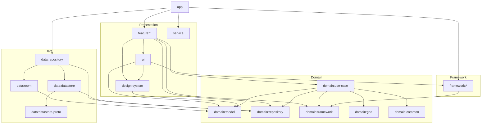

# Yagni Launcher Architecture

This document describes how Yagni Launcher's Gradle modules are organized and how they map onto Clean Architecture. It focuses on stable module responsibilities and dependency rules rather than an inventory of classes, which changes far more often than the architecture itself.

---

## Table of Contents

- [Clean Architecture Layers](#clean-architecture-layers)
- [Dependency Rule](#dependency-rule)
- [Dependency Diagram](#dependency-diagram)
- [Module Groups](#module-groups)
  - [Domain](#domain)
  - [Data](#data)
  - [Framework](#framework)
  - [Presentation](#presentation)
  - [Shared Infrastructure](#shared-infrastructure)
- [design-system, ui, and feature:* Boundaries](#design-system-ui-and-feature-boundaries)
- [Further Reading](#further-reading)

---

## Clean Architecture Layers

The codebase is split into four layers:

1. **Domain** — Pure Kotlin entities, repository/framework interfaces, use cases, and grid algorithms. No Android SDK imports.
2. **Data** — Persistence implementations: Room database, Proto DataStore preferences, and the repositories that combine them.
3. **Framework** — Thin wrappers around Android system APIs (`PackageManager`, `LauncherApps`, `WallpaperManager`, `AppWidgetManager`, etc.), most of them implementing an interface declared in `domain:framework`.
4. **Presentation** — Compose UI, ViewModels, and services: the `feature:*` screens, the `ui` and `design-system` component libraries, and the `service` background services.

## Dependency Rule

Dependencies only point **inward**: Presentation depends on Framework and Domain, Data depends on Domain, and Framework depends on Domain. Domain depends on nothing else in the project. No inner layer ever references an outer one.

## Dependency Diagram

The diagram below is intentionally simplified to the module *groups*; edit it directly as modules are added, split, or merged.

---

## Module Groups

### Domain

Pure Kotlin modules with no Android dependency, so their logic is fully unit-testable in isolation:

| Module | Responsibility |
|---|---|
| `domain:model` | Entity and value-object definitions shared by every other layer. |
| `domain:repository` | Repository interfaces describing the data operations the domain needs; implemented by `data:repository`. |
| `domain:framework` | Interfaces abstracting Android system services; implemented by the `framework:*` modules. |
| `domain:use-case` | Application business logic, composed from repositories and framework interfaces. |
| `domain:grid` | Grid layout and collision-resolution algorithms used when moving or resizing items. |
| `domain:common` | Cross-cutting abstractions such as coroutine dispatcher qualifiers. |

### Data

Concrete persistence implementations behind the `domain:repository` interfaces:

| Module | Responsibility |
|---|---|
| `data:repository` | Repository implementations that combine `data:room` and `data:datastore` sources. |
| `data:room` | The local SQLite database (grid items, installed apps, widgets, shortcuts, icon packs). |
| `data:datastore` | User settings persistence via Proto DataStore. |
| `data:datastore-proto` | The `.proto` schema definitions consumed by `data:datastore`. |

### Framework

Each `framework:*` module wraps a single Android system API so the rest of the codebase never imports it directly (e.g. `framework:launcher-apps`, `framework:package-manager`, `framework:wallpaper-manager`, `framework:widget-manager`, `framework:icon-pack-manager`, `framework:file-manager`, `framework:resources`, `framework:accessibility-manager`, `framework:notification-manager`, `framework:settings`, `framework:image-serializer`, `framework:user-manager`, `framework:jaro-winkler-similarity`).

Most of these modules implement an interface declared in `domain:framework` and are bound to it via Hilt, which lets the domain layer depend on the abstraction instead of the Android API. A few modules (for example `framework:user-manager`, `framework:accessibility-manager`, `framework:notification-manager`, `framework:settings`, and `framework:image-serializer`) wrap a system API directly without a `domain:framework` interface, since nothing in the domain layer currently needs to consume them through an abstraction.

### Presentation

| Module | Responsibility |
|---|---|
| `feature:*` (`home`, `action`, `pin`, `edit-application-info`, `edit-grid-item`, `settings:*`) | Feature-specific screens, ViewModels, and UI state. |
| `design-system` | Generic, application-agnostic Compose primitives. |
| `ui` | Shared, application-aware UI reused by multiple features. |
| `service` | Background Android services (accessibility, notification listener, icon pack updates). |

### Shared Infrastructure

| Module | Responsibility |
|---|---|
| `app` | Wires every module together: Hilt setup, `Application` class, and the root Activity/navigation graph. |
| `common` | Application-wide Hilt bindings (icon key generation, coroutine dispatchers). |
| `build-logic` | Gradle convention plugins that standardize module build configuration. |

---

## design-system, ui, and feature:* Boundaries

These three module groups all sit in the Presentation layer, but each has a distinct responsibility:

- **`design-system`** contains generic, reusable visual primitives — theming, icons, animations, dialogs, and other Compose building blocks that carry no knowledge of the launcher's domain models or features. It depends only on `domain:model` for the types it renders.
- **`ui`** contains shared, *application-aware* UI: composites built from `design-system` primitives that are reused across multiple features (dialogs like `SelectApplicationDialog`, settings composables, etc.), and it exposes the `framework:*` modules as API dependencies so features can reach framework implementations through a single dependency on `:ui`. It depends on `design-system`.
- **`feature:*`** modules contain screens, ViewModels, and UI state specific to one feature. They depend on both `design-system` and `ui` (added automatically by the `feature` Gradle convention plugin) plus whatever `domain:*` modules that feature's use cases require.

---

## Further Reading

For a deeper treatment of why modularization and this layering approach are useful, see the Now in Android [modularization learning journey](https://github.com/android/nowinandroid/blob/main/docs/ModularizationLearningJourney.md).
